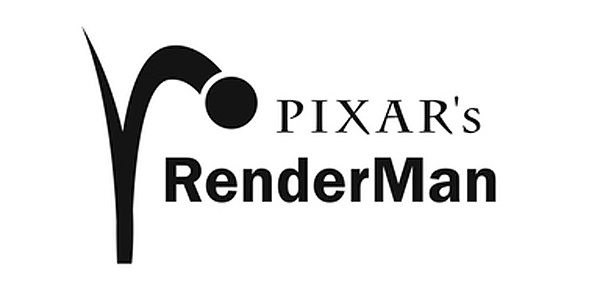
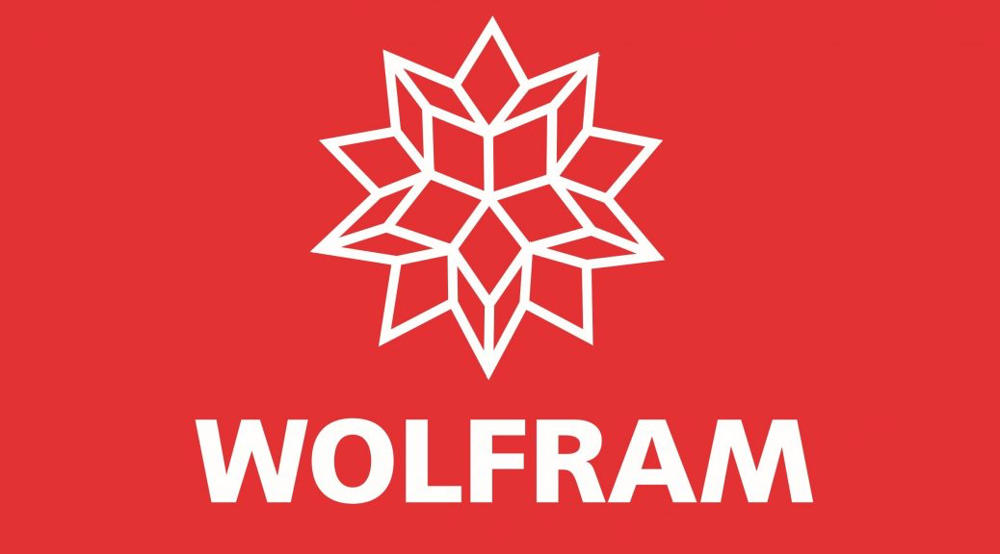

## The Shift in Filmmaking

::: {.incremental}
- **Linear pipeline** $\rightarrow$ **Interactive, collaborative workflow**
- **Real-time computer graphics** meets **cinematic practice**
- **Simultaneous on-set decisions**: Lighting, camera composition, and visual effects happen together rather than in sequence.
:::

::: {.notes}
- Traditional filmmaking separates production and post-production.
- Real-time game engines allow departments to work together synchronously.
:::

---

## Classic VFX Production Pipeline

The traditional pipeline is **linear** and **sequential**. Decisions are deferred to post-production, leading to high revision costs if changes are made late.

```{mermaid}
%%| fig-align: center
graph LR
    subgraph Pre [Pre-Production]
        Script[Script / Storyboard] --> Concept[Concept Art]
    end
    subgraph Prod [Physical Shoot]
        Concept --> Shoot[Live Action Shoot]
    end
    subgraph Post [Post-Production VFX]
        Shoot --> Match[Matchmove & Tracking]
        Match --> Assets[Asset Creation]
        Assets --> Anim[Layout & Anim]
        Anim --> FX[FX & Simulation]
        FX --> Light[Lighting & Render]
        Light --> Comp[Compositing]
        Comp --> Final[Final Delivery]
    end

    style Script fill:#3f51b5,stroke:#fff,stroke-width:1px,color:#fff
    style Concept fill:#3f51b5,stroke:#fff,stroke-width:1px,color:#fff
    style Shoot fill:#e91e63,stroke:#fff,stroke-width:1px,color:#fff
    style Match fill:#4caf50,stroke:#fff,stroke-width:1px,color:#fff
    style Assets fill:#4caf50,stroke:#fff,stroke-width:1px,color:#fff
    style Anim fill:#4caf50,stroke:#fff,stroke-width:1px,color:#fff
    style FX fill:#4caf50,stroke:#fff,stroke-width:1px,color:#fff
    style Light fill:#4caf50,stroke:#fff,stroke-width:1px,color:#fff
    style Comp fill:#4caf50,stroke:#fff,stroke-width:1px,color:#fff
    style Final fill:#ffc107,stroke:#fff,stroke-width:1px,color:#333
```

::: {.notes}
- Pre-production establishes the plan.
- The shoot captures physical plates without background elements (using green screen).
- Everything else is post-production. High risk if there is an issue with the plates or assets.
:::

---

## Virtual Production (VP) Pipeline

The Virtual Production pipeline is **iterative** and **non-linear**. Assets are built early and updated dynamically via a real-time feedback loop.

```{mermaid}
%%| fig-align: center
graph TD
    subgraph VAD [Virtual Art Department]
        VAD_Assets[Real-time Assets] <--> Previz[Previz & Techviz]
    end
    subgraph Prod [Virtual Production Shoot]
        Engine[Real-time Engine] <--> LED[LED Volume Playback]
        Engine <--> Tracker[Camera Tracking]
        LED --> Shoot[ICVFX Capture]
        Actors[Actors / Sets] --> Shoot
    end
    subgraph Post [Post-Production]
        Shoot --> Clean[Color & Cleanup]
        Clean --> Final[Final Delivery]
    end

    VAD_Assets <--> Engine
    
    style VAD_Assets fill:#2196F3,stroke:#fff,stroke-width:1px,color:#fff
    style Previz fill:#2196F3,stroke:#fff,stroke-width:1px,color:#fff
    style Engine fill:#9C27B0,stroke:#fff,stroke-width:1px,color:#fff
    style LED fill:#9C27B0,stroke:#fff,stroke-width:1px,color:#fff
    style Tracker fill:#9C27B0,stroke:#fff,stroke-width:1px,color:#fff
    style Shoot fill:#E91E63,stroke:#fff,stroke-width:1px,color:#fff
    style Final fill:#FFC107,stroke:#fff,stroke-width:1px,color:#333
```

::: {.notes}
- The VAD (Virtual Art Department) builds 3D assets upfront.
- Previz and techviz define camera and layout.
- The LED walls provide perspective-correct backgrounds via real-time camera tracking.
- Post-production footprint is greatly reduced to color grading and minor cleanups.
:::

---

## Pipeline Comparison

| Paradigm | Classic VFX Pipeline | Virtual Production Pipeline |
|---|---|---|
| **Workflow** | Linear / Sequential | Iterative / Parallel |
| **Asset Creation** | In Post-Production | In Pre-Production (VAD) |
| **Feedback Loop** | Delayed (Weeks/Months) | Real-time (On-set) |
| **Final Capture** | Greenscreen (Composite later) | In-Camera VFX (ICVFX) |

::: {.notes}
- Briefly summarize this table.
- Emphasize the shift in where decisions and budgets are allocated.
:::

---

## The VP Stage in Action {background-image="assets/L1020142.JPG" background-size="cover"}

::: {.notes}
- This is a photo of the actual 32' x 16' LED stage with RIT students in action.
- Explain the visual layout: LED wall, inner and outer frustums.
:::

---

## The Pedagogical Gap

::: {.columns}
::: {.column width="60%"}
- **Tool-Specific Training Focus:** Many existing curricula emphasize learning a specific software (e.g., Unreal Engine) rather than the overall workflow.
- **Academic vs. Industry Pacing:** Need to balance industry-grade collaborative technical rigor with academic flexibility and different learning styles.
- **The Goal:** Deliver visual literacy that bridges creative storytelling with deep technical adaptability.
:::
::: {.column width="40%"}
::: {.callout-note icon=false}
### The Core Objective
Adapt industry-standard tools, systems, and pipelines for early VP education while preserving the flexible pacing of an academic environment.
:::
:::
:::

::: {.notes}
- Traditional courses treat VP as a mere extension of game design.
- Our curriculum teaches the full integrated pipeline from scratch.
:::

---

## The Industry-Aligned Platform

::: {.columns}
::: {.column width="50%"}
### Hardware & Stage
- **The Stage:** 32′ × 16′ LED wall with a 2.3 mm pixel pitch.
- **The Processors:** Brompton processors driving the LED panels.
- **The Power:** GPU workstation with dual **NVIDIA A6000** GPUs rendering separate inner (camera frustum) and outer (context/lighting) views.
:::

::: {.column width="50%"}
### System Integration
- **Unreal Engine:** Runs the virtual environment and manages color calibration.
- **Mo-Sys Tracking:** Synchronizes physical camera movement to the virtual camera in real time.
- **Network Fabric:** Central workstation coordinates communication over a dedicated high-speed Ethernet network.
:::
:::

::: {.notes}
- The dual GPU setup allows rendering the perspective-correct inner frustum for the camera and a lower-res outer frustum for lighting and reflections on the actors.
:::

---

## A Heterogeneous Cohort

::: {.incremental}
- **Diverse Backgrounds:** Enrolled students from Film, Animation, Game Design, and Digital Media.
- **Minimal Prerequisites:** Only basic familiarity with imaging concepts and at least one production tool (e.g., 3D modeling, game engine, or version control) was recommended.
- **Core Focus:** Building confidence in multi-role collaboration and establishing a shared language between technical and creative disciplines.
:::

::: {.notes}
- The class had 11 students.
- Getting students with different backgrounds to work together is a key challenge and success of the course.
:::

---

## Three Learning Environments

::: {.columns}

::: {.column width="33%"}
### 1. Screening Room
For conceptual critique, storyboarding, shot planning, and narrative flow evaluation.
:::

::: {.column width="33%"}
### 2. Media Lab
For digital asset creation (Unreal, Blender, Nuke), previsualization, and version control (Perforce).
:::

::: {.column width="33%"}
### 3. LED Stage
For full hardware integration, camera calibration, lighting matches, and live-action shoot.
:::

:::

::: {.notes}
- Students move between these three spaces iteratively depending on the milestone.
- The separation helps structure the workflow from concept to asset to stage.
:::

---

## Course Progression

::: {.columns}
::: {.column width="33%"}
### Weeks 1–2
**System Introduction**
- Tour of the LED stage.
- Examination of rendering & tracking pipelines.
- Hands-on camera and wall operation.
:::
::: {.column width="33%"}
### Weeks 3–5
**Concept & Teams**
- Storyboards and engine blockouts.
- Feasibility reviews and critiques.
- Production team formation.
:::
::: {.column width="33%"}
### Weeks 6+
**Iterative Production**
- Testing camera, lighting, and physical alignment.
- Rotating roles (camera, lighting, control board, actor).
:::
:::

::: {.notes}
- Role rotation ensures every student understands the operational dependencies of the stage.
:::

---

## Assessment Milestones

::: {.columns}
::: {.column width="33%"}
### Storyboard
Defines the narrative flow, shot composition, and staging intent.
:::
::: {.column width="33%"}
### Previsualization
Rolling submissions of shot drafts, camera tests, and environment blockouts.
:::
::: {.column width="33%"}
### Techviz
Finalizing the toolchains, assets, role assignments, and stage readiness.
:::
:::

::: {.notes}
- The assessment balances creative outcomes with technical planning and teamwork.
- Summarized in the paper [@knuth84].
:::

---

## Key Takeaways

::: {.incremental}
- **Ecosystem Fluency:** Students learned how early creative choices (e.g., set design) dictate downstream technical constraints (e.g., frame rate, GPU memory).
- **Workflow Literacy:** Hands-on experience with industry tools: Unreal Engine, Blender, Nuke, Premiere, and Perforce.
- **The "Hidden" Lesson:** The critical importance of IT infrastructure, network speed, version control, and team logistics in large-scale production.
:::

::: {.notes}
- Working across spaces made infrastructure dependencies highly visible.
- Teamwork and communication were as important as technical skills.
:::

---

## Thank You

::: {.columns}
::: {.column width="60%"}
### Acknowledgments
- Supported by the **Epic Games MegaGrant**, RIT Previsualization and Virtual Production Curriculum Development.
- Supported in part by the **National Science Foundation** (Grant No. 2238180).
- Special thanks to RIT's MAGIC Center, MAGIC IT team, and the lab staff.
:::

::: {.column width="40%"}
::: {layout-ncol=3}
{width="120px"}
{width="120px"}
{width="120px"}
:::
:::
:::

---

## References

::: {#refs}
:::
